# Olá, eu sou o Werner! 👋 

  

  
  
  
  

---

## 👨‍💻 Sobre mim

- 🏢 Atualmente atuo como **Desenvolvedor** (Analista / Salesforce)
- 🎓 Possuo duas formações acadêmicas em T.I e procuro estar sempre me atualizando
- 🌱 Sempre em busca de aprender novas tecnologias e aprimorar minhas habilidades
- 💡 Foco em criar soluções de qualidade e eficientes, somando conhecimento aos meus repositórios

---

## 🛠️ Minhas Habilidades / Skills

Aqui estão algumas das tecnologias e ferramentas com as quais tenho trabalhado e tenho conhecimento. 

  
  
  
  
  
  
  
  
  
  
  
  
  
  
  

---

## 📊 Estatísticas do GitHub e Linguagens

Abaixo você encontra as métricas dos meus repositórios geradas automaticamente, incluindo um gráfico indicando as linguagens com as quais eu mais contribuo aqui no GitHub!

  

  

  

---

<!-- Contador de Visitantes -->

  

